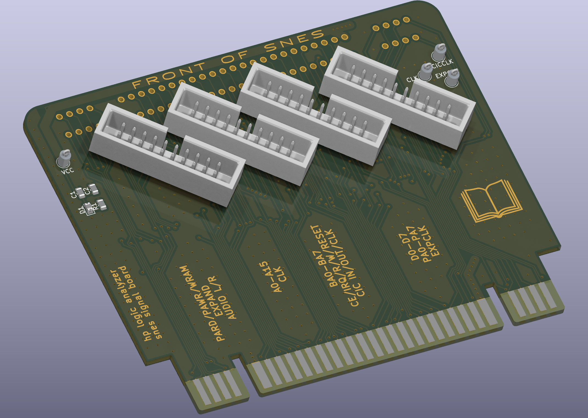

# SNES-signal-sniffer
SNES logic analyzer breakout board. Used for debugging SNES carts in-situ with a logic analyzer. I have an HP1670D so the LA configuration file is written for that, but all pins are exposed and you can connect just the lines you need. There might be a bug with the CIC lines because some carts I use seem to reboot the SNES sporadically. I have not looked into the issue yet since mostly I was looking at bootcode, it did not effect my use.

